Rehber
=========

.. _installation:

Kurumsal E-Posta Hesabıyla Giriş Yapma
--------------------------------------

BTDestek sistemine kurumsal e-posta hesabı **(@rumeli.edu.tr)** ile giriş yapmak için **“Google ile Giriş Yap”** seçeneğine tıkladıktan sonra, kurumsal e-posta hesabınızı seçebilir eğer giriş yapmadıysanız kurumsal e-posta adresinizi ve şifrenizi yazarak giriş yapabilirsiniz.

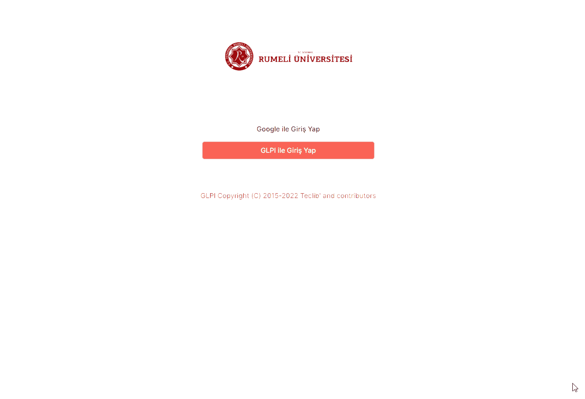

BTDestek Arayüzü
----------------

BTDestek sayfasına girdikten sonra sayfanın sol tarafında hızlı menü bulunmaktadır.

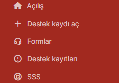

**Açılış:** Açılan destek kayıtlarının özetini bu sayfada bulunur.

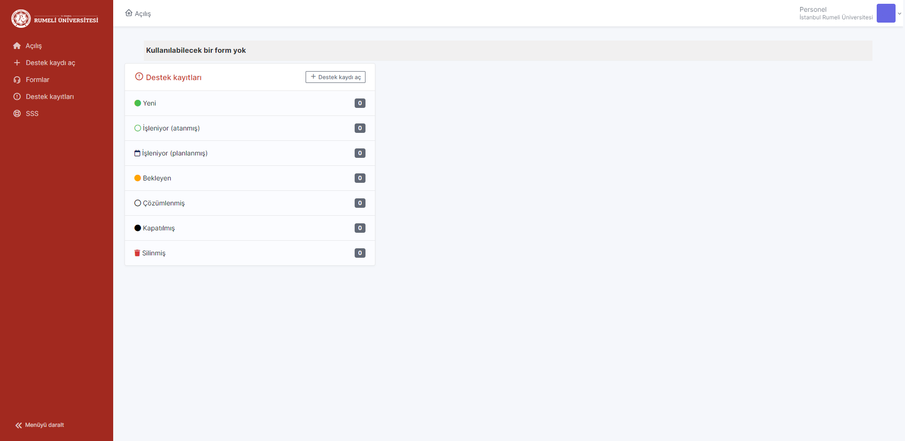

**Destek Kaydı Aç:** İstek ve arıza için destek talebi açmanızı sağlar.

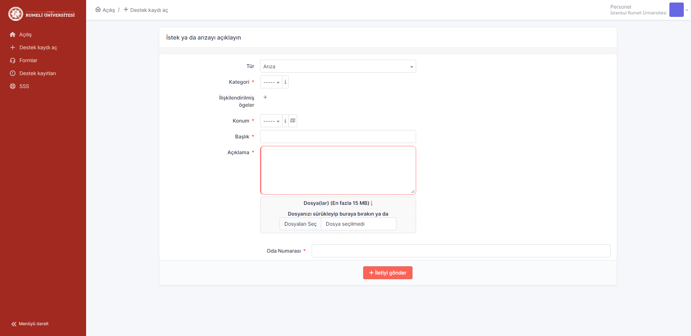

**Formlar:** Bilgi İşlem Daire Başkanlığı tarafından oluşturulmuş anket, talep veya formlar bulunmaktadır.

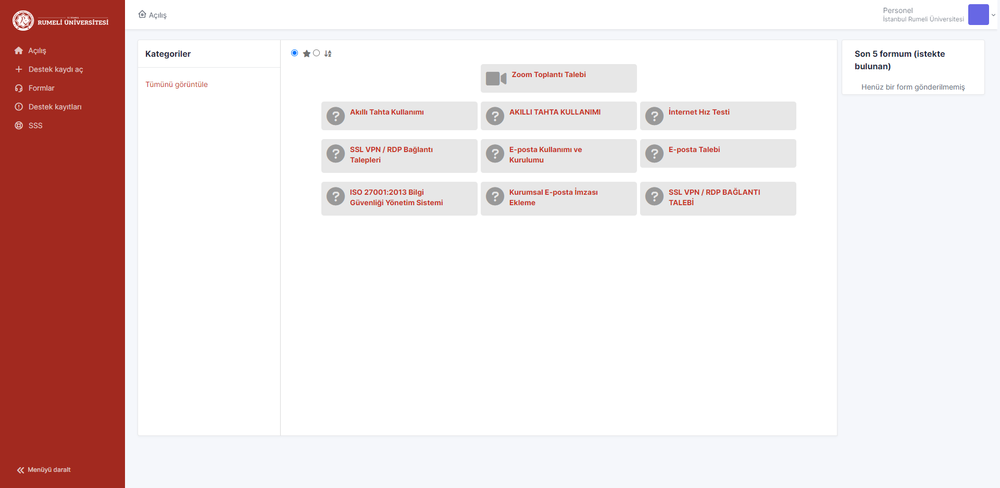

**Destek Kayıtları:** Açılan destek kayıtları bu alanda görüntülenir.

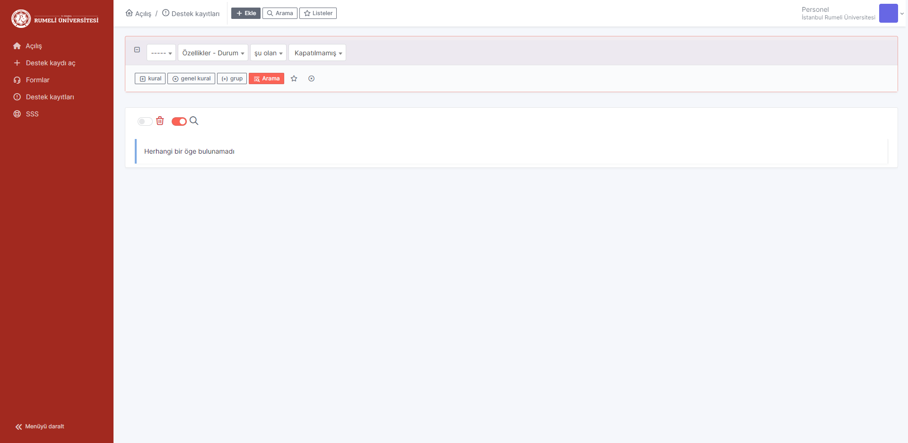

**SSS:** Bu alanda sizler için hazırlanmış olan rehber ve kullanım kılavuzları bulunur. 

      **Arama:** Rehber ve kılavuzları aratır.

      **Göz at:** Tüm rehber ve kılavuzlar bu alanda görünür.

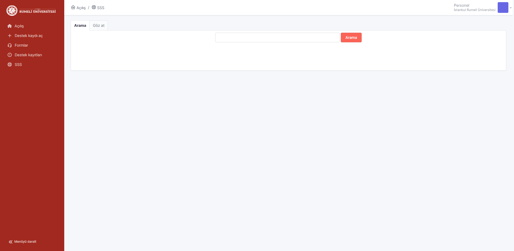

Destek Talebi Açma
------------------
Bilgi İşlem Daire Başkanlığı’na istek ve arıza talebinde bulunmak için sayfanın sol tarafında bulunan menü üzerinden **“Destek kaydı aç”** seçeneğini tıklayın.

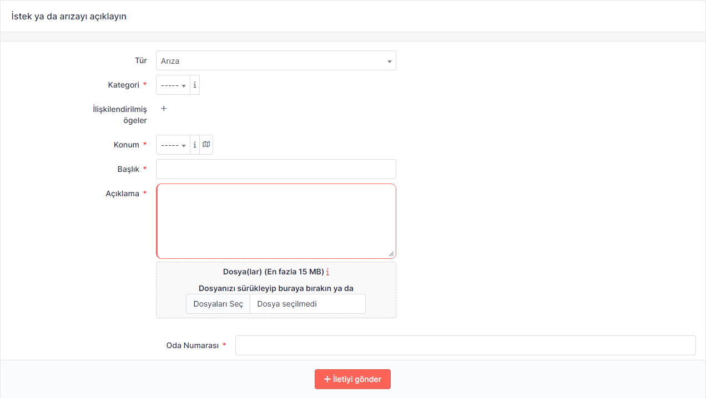

Gelen ekranda istek ve arıza destek talebiniz için alan metin alanları bulunmaktadır. (*) işareti olan alanların girilmesi zorunlu olduğunu belirtir.

      **Tür:** Talebinizin hangi türde olduğunu belirtir. Eğer bir donanımda sorun veya arıza ile karşılaştıysanız “arıza”. Kurulum, tanımlama ve talepler için “istek” olarak seçebilirsiniz.

      **Kategori**: Destek talebinin donanım, internet, yazılım vb. alanında belirtir.

      **İlişkilendirilmiş ögeler:** Üniversitemizin size tahsis etmiş olduğu ve etkilenen bilgisayar, monitör, telefon vb. cihazınızı seçebilirsiniz.

      **Konum:** Destek talebi olarak bulunduğunuz yerleşkeyi belirtin.

      **Başlık:** Talebiniz ne olduğunu tek cümle ile belirtebilirsiniz. Örnek: İnternet arızası

      **Açıklama:** Talebinizi detaylı bir şekilde bu alanda açıklayabilirsiniz. Talebiniz hakkında fazla detay verebilirseniz ekibimiz talebiniz anlayabilir ve daha hızlı bir şekilde çözebilir.

      **Oda numarası:** Talep olarak bulunduğunuz veya destek istediğiniz odayı oda numarası olarak (genellikle odanın girişinde bulunur.) belirtilmelidir. Eğer bulunduğunuz odanın oda numarasını belirtilmemiş ise referans verebilirsiniz. Örnek: Kütüphanenin karşısındaki oda

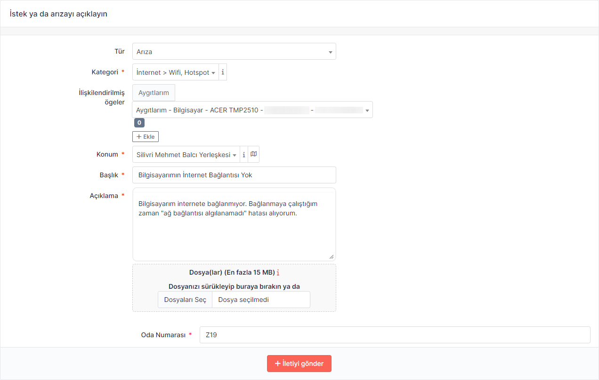

Gerekli alanlar doldurulduktan sonra “İletiyi gönder” seçeneğine tıklayın. Eğer alanlara eksik veya hatalı bilgi girildiyse hata mesajı alırsınız. Gerekli alanları eksiksiz ve doğru bir şekilde girdikten sonra sayfanın sağ altında bulunan talebinizin oluşturulduğunu gösteren bildirim alanı görünür. Ek olarak açılan destek talebiniz ayrıca e-posta olarak gönderilir.

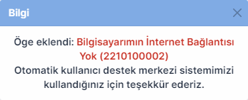

Açılan Destek Talebini Görüntüleme ve Cevaplama
-----------------------------------------------

Açılan destek talebini **“Açılış”** veya **“Destek Kayıtları”** üzerinden görüntüleyebilirsiniz.

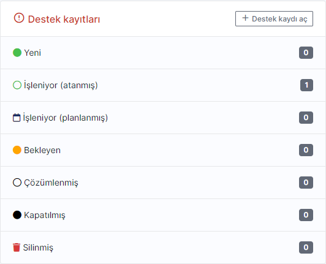

    *Açılış sayfasında bulunan destek kayıtları özet görünümü*

Bakınız: :ref:`my-reference-label`

Destek talebinizi durumu ve açıklamalarını ve cevaplarını detaylı bir şekilde görüntülemek için sayfanın sol tarafında bulunan menüden “Destek kayıtları” seçeneğine tıklayın.

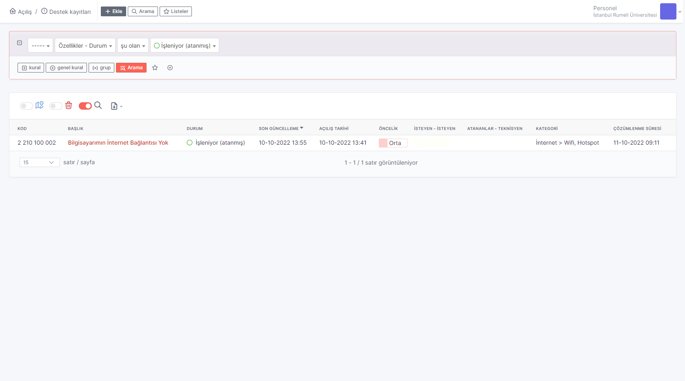

Görüntülemek istediğiniz destek kaydını başlık sütunundan seçin.

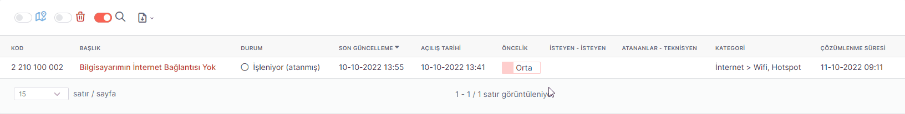

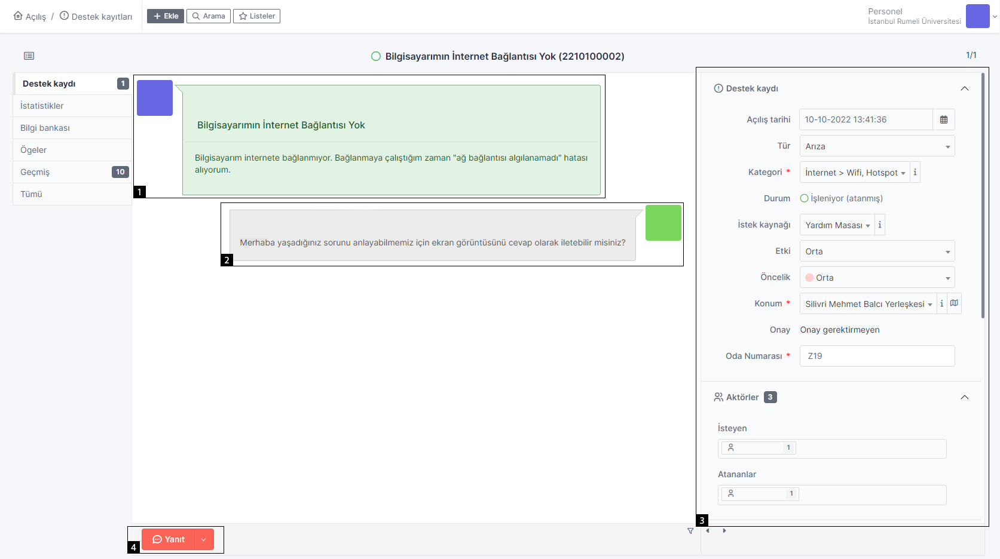

   
#. Talebinizin açıklaması ve veridiniz cevaplar mesaj alanın sol tarafında bulunur.
#. Destek ekibinin talebinize vermiş olduğunuz cevaptır. Mesajı alanın sağ tarafında bulunur.
#. Destek talebinizin bilgi ve detayları bulunmaktadır.
#. Destek talebine cevap vermek veya belge eklemek için kullanılır.

Talebe cevap vermek isterseniz **“Yanıt”** seçeneğini seçtikten sonra mesaj alanın sağ tarafında çıkan mesaj balonu üzerinden cevaplayabilir ve belge ekleyebilir ardından “Ekle” seçeneğine tıkladıktan sonra cevabı gönderebilirsiniz.

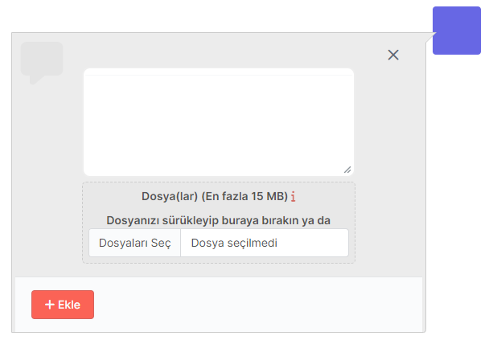

Eğer sadece belge eklemek isterseniz “Yanıt” seçeneğinin sağında bulunan ok işaretine tıkladıktan sonra “Belge ekle” seçeneğine tıkladıktan sonra mesaj alanın sağ tarafında bulunan mesaj balonunda belge ekleyebilirsiniz.

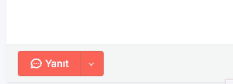

.. _my-reference-label:

Destek Kaydı Kategoriler
----------------

=========== ========
Kategori    Açıklama
=========== ========
TEST        123
=========== ========

Talep Durumları
----------------

.. list-table:: Talep Durumları
   :header-rows: 0

   * - **Yeni** 
     - Destek talebinin açılmıştır.
   * - **İşleniyor (atanmış)** 
     - Destek talebini ilgili ekibimize gönderilmiştir.
   * - **İşleniyor (planlanmış)** 
     - | Destek talebiniz ekibimize gönderilmiş ve işlem sırasına 
       | alınmış veya talebiniz hazırlanıyor.
   * - **Bekleyen** 
     - | Eğer destek talebiniz bekleme durumunda ise, ekibimiz talebinizi çözmek
       | ve ihtiyaçlarınızı karşılaması sebebi ile alınmıştır.
       | Örnek: parça değişimi, sarf malzeme temini, teknik servise gönderilmesi vb.
   * - **Çözümlenmiş/Kapatılmış** 
     - | Destek talebinizi ihtiyacınız karşılanmış veya sorununuz çözülmüştür.
       | Talebiniz bu duruma güncellenmesi durumda cevap alanı kapatılır.

Memnuniyet Anketi Doldurma
--------------------------
Ekibimiz gelen bütün destek talepleri en hızlı bir şekilde çözmektedir. Öneri ve şikayetlerinizi her talep kapatıldıktan sonra e-posta adresinize gelen e-posta iletisi üzerinden veya “Açılış” sayfasında bulunan memnuniyet anketi üzerinden 2 soruluk anket ile bize iletebilirsiniz. Ekibimiz her gelen cevabı değerlendirmektedir.

Memnuniyet anketini doldurmak için destek talebinizin açıklama sütunundan seçin.

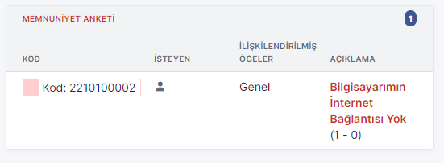

Çıkan ekranda bulunan iki soruluk anketi cevapladıktan sonra (Notlar alanını doldurmak isteğe bağlıdır.)

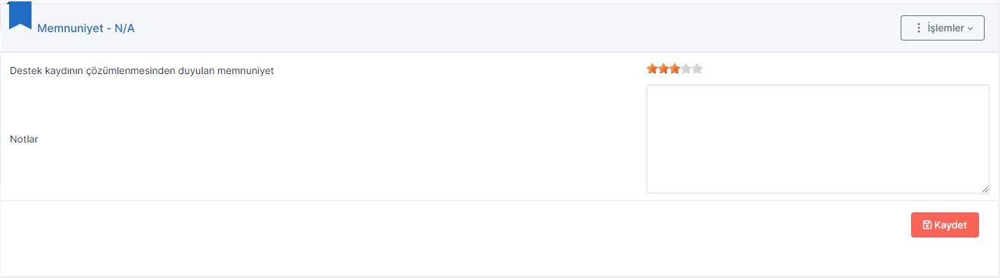

.. list-table:: Değerlendirme
   :header-rows: 1

   * - **Derece** 
     - **Açıklama**
   * - **1 yıldız** 
     - Çök Kötü
   * - **2 yıldız** 
     - Kötü
   * - **3 yıldız** 
     - Ortalama
   * - **4 yıldız** 
     - İyi
   * - **5 yıldız** 
     - Çok İyi

